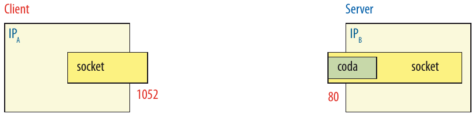
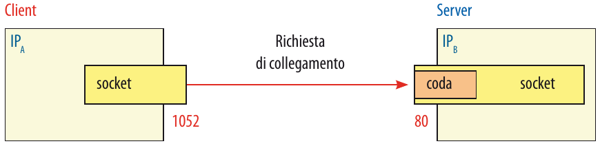
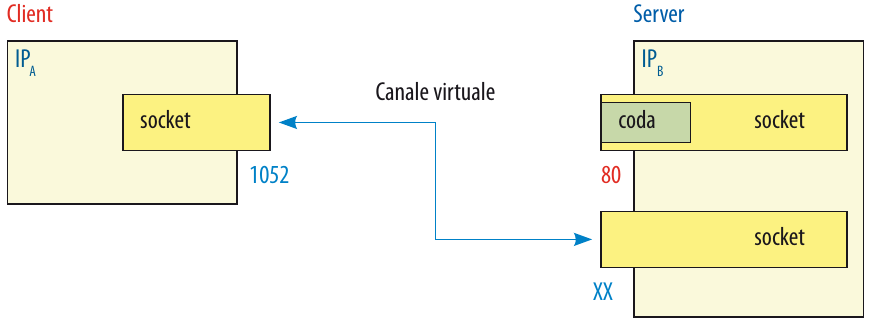
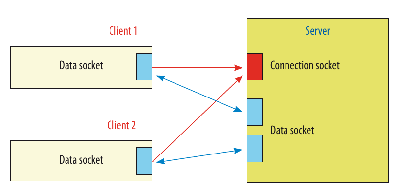

# Socket

---

## Generalità

In generale un’applicazione di rete è costituita da un insieme di programmi che vengono eseguiti su due o più computer contemporaneamente.

I processi hanno la necessità di scambiare messaggi con gli altri processi della medesima applicazione, sia che essi appartengano alla stessa rete locale oppure che siano remoti e quindi dislocati dall’altra parte del globo: per comunicare tra loro questi processi devono mettersi in “contatto” tramite i loro indirizzi e utilizzare i servizi offerti dal livello di applicazione.

---

## TCP e UDP
TCP e UDP svolgono funzioni diverse, cioè offrono servizi diversi allo strato applicativo:
- TCP è un protocollo di trasporto orientato alla connessione ed è affidabile dato che consente il controllo dell’integrità dell’informazione contenuta nei pacchetti e dispone di un sistema per segnalare l’errore al mittente.
- UDP è un protocollo di trasporto non orientato alla connessione e non affidabile.

---

## Socket

>Affinché un processo, presente su un determinato host, invii un messaggio a un qualsiasi altro host, il processo mittente deve identificare il processo destinatario in modo univoco.

Generalmente ogni PC ha una sola porta fisica di connessione al network, se più applicazioni necessitano di utilizzare la rete, devono essere riconosciute in qualche modo.

Questo metodo di riconoscimento viene effettuato tramite le cosiddette porte logiche identificate da un numero detto **numero di porta**. Il numero di porta è di 16 bit e può quindi assumere valori compresi tra 0 e 65535.

---

## Socket

Le porte da 0 a 1023 sono dette "well-known ports" e sono riservate per i servizi di rete più comuni, come ad esempio http (80), ftp (21), telnet (23), ecc.

Le porte da 1024 a 49151 sono dette "registered ports" e sono riservate per i servizi di rete meno comuni, ma possono essere utilizzate da chiunque.

Le porte da 49152 a 65535 sono dette "dynamic and/or private ports" e sono riservate per i servizi di rete temporanei, come ad esempio le connessioni ftp passive o le connessioni telnet.

---

## Socket

Il solo numero di porta non è sufficiente per identificare univocamente un processo, infatti, se più processi utilizzassero la stessa porta, non sarebbe possibile distinguere i messaggi inviati da un processo da quelli inviati da un altro. Per questo motivo, oltre al numero di porta, è necessario utilizzare anche l’indirizzo IP.

>È bene sottolineare il fatto che i numeri di porta logica sono relativi soltanto al protocollo considerato: una determinata porta per il protocollo TCP è diversa dallo stesso numero di porta per il protocollo UDP (si tratta effettivamente di porte diverse) anche se in genere viene utilizzato lo stesso numero di porta per un servizio che gestisce entrambi i protocolli.

Un socket consente quindi di comunicare attraverso la rete usando la pila TCP/IP.

---

## Socket

Esiste una struttura chiamata "association" che contiene tutte le informazioni necessarie per identificare univocamente una connessione, cioè:
- l'indirizzo IP del mittente
- il numero di porta del mittente
- l'indirizzo IP del destinatario
- il numero di porta del destinatario

---

## Socket
Il modello client-server è organizzato in due moduli, chiamati appunto server e client, operanti su macchine diverse:
- il server svolge le operazioni necessarie per realizzare un servizio
- il client, generalmente tramite un’interfaccia utente, acquisisce i dati, li elabora e li invia al server richiedendo un servizio.

Quindi in rete sono presenti calcolatori su cui girano processi server che erogano servizi e sono in attesa di ricevere richieste di connessione da parte di processi client interessati a usufruire di tali servizi.

---

## Socket

Il concetto di socket è stato sviluppato come estensione diretta del paradigma UNIX di I/O su file, che si basa sulla sequenza di operazioni open-read-write-close:
- open: permette di accedere ad un file
- read/write: accedono ai contenuti del file
- close: terminazione dell’utilizzo del file

L’utilizzo dei socket avviene pressoché con la stessa modalità ma aggiungendo a questa struttura l’insieme dei parametri necessari a realizzare la connessione tra macchine remote, cioè richiedendo:
- gli indirizzi
- il protocollo e numero di porta
- il tipo del protocollo

---

## Socket

Ogni sistema operativo mette a disposizione nelle API i meccanismi per realizzare l’interfacciamento tra diversi protocolli: le socket API sono delle specifiche API di protocollo che hanno origine con Berkeley BSD UNIX e che oggi sono disponibili in qualunque sistema operativo.

Elenchiamo le funzioni presenti sia in C che in Java che verranno utilizzate in seguito:
- socket(): crea un socket
- bind(): assegna un indirizzo di rete ad un socket
- listen(): mette in ascolto un socket
- accept(): accetta una connessione in ingresso
- connect(): stabilisce una connessione con un altro socket

---

- send(): invia dati su un socket
- recv(): riceve dati da un socket
- close(): chiude un socket

---

## Famiglie di socket

Le famiglie di socket sono un insieme di protocolli che possono essere utilizzati per realizzare una connessione. Le famiglie di socket più comuni sono:
- AF_INET: per la comunicazione in Internet
- AF_UNIX: per la comunicazione in locale

---

## Tipi di socket

I socket sono fondamentalmente di tre tipi e per ciascuna tipologia abbiamo una diversa modalità di connessione:

- **Stream socket**: sono socket orientati alla connessione e sono utilizzati per la comunicazione affidabile e bidirezionale. La connessione è stabilita tramite il protocollo TCP e la comunicazione è full-duplex. I dati vengono inviati in modo sequenziale e non vengono per
nessun motivo duplicati o persi.

- **Datagram socket**: sono socket non orientati alla connessione e sono utilizzati per la comunicazione non affidabile e bidirezionale. La connessione è stabilita tramite il protocollo UDP e la comunicazione è half-duplex. I dati vengono inviati in modo non sequenziale e possono essere duplicati o persi.

---

- **Raw socket**: sono socket non orientati alla connessione e sono utilizzati per la comunicazione non affidabile e bidirezionale. Vengono utilizzati per inviare pacchetti IP personalizzati. 

---

## Stream socket

Con gli stream socket si realizza una connessione sequenziale tipicamente asimmetrica, affidabile e full-duplex basata su stream di byte di lunghezza variabile.

Operativamente, ogni processo crea il proprio endpoint creando l’oggetto `socket` in Java e successivamente:
- il server si mette in ascolto, in attesa di un collegamento, e quando gli arriva una richiesta la esaudisce mediante la primitiva `accept()` che crea un nuovo socket dedicato alla connessione;
- il client si pone in coda sul socket del server e quando viene “accettato” dal server crea implicitamente il binding con la porta locale.

---
## Stream socket
>Tra i due processi **server** e **client**, il **server** è quello che ha controllo maggiore poiché è il processo che inizialmente crea il socket: più **client** possono comunicare attraverso lo stesso socket ma solo un **server** può essere associato a uno specifico socket.
>Inoltre il **client** ha bisogno di conoscere l’indirizzo del **server** mentre il **server** acquisisce le informazioni del **client** (e, quindi, anche il suo indirizzo) solo dopo che viene stabilita la connessione.

---

## Stream socket
Inizializzazione dei processi

Il client invia una richiesta di connessione al server

---

## Stream socket
Il server accetta la connessione e crea un nuovo socket dedicato alla connessione

ll server accetta la richiesta e realizza “un canale virtuale” tra il client e un nuovo socket del server (indicato XX), in modo da lasciare il primo libero per le ulteriori richieste da parte di altri client.

---
## Stream socket

I due processi si scambiano i dati (funzioni `read()` e `write()`) fino alla chiusura del canale, che viene effettuata rispettivamente mediante la chiamata della primitiva `close()`.

Nella figura a lato possiamo osservare che in un server TCP abbiamo due tipi di socket: il socket di ascolto e il socket di connessione.

---

## Datagram socket

Con i datagram socket viene realizzata la comunicazione che permette di scambiare dati senza connessione (i messaggi contengono l’indirizzo di destinazione e provenienza) mediante il trasferimento di datagrammi che inoltrano messaggi di dimensione variabile, senza garantire ordine o arrivo dei pacchetti.

Permettono quindi di inviare da un socket a più destinazioni e ricevere su un socket da più sorgenti: in generale realizzano quindi il modello *"molti a molti"* e sono supportate nel dominio Internet dal protocollo UDP.

---
## Datagram socket

Operativamente, ogni processo crea il proprio endpoint richiamando la primitiva che crea il socket e successivamente:
- il server si mette in attesa di ricevere i dati (mediante la primitiva `receive()`), e alla loro ricezione li processa e invia una risposta (mediante la primitiva `send()`);
- il client invia i dati (mediante la primitiva `send()`) e si mette in attesa di ricevere una risposta (mediante la primitiva `receive()`).

Al termine della comunicazione, uno dei processi chiude il socket (mediante la primitiva `close()`).

---

## Trasmissione unicast e multicast
L’unicast è la “normale” situazione in cui un mittente invia e un destinatario riceve, con eventualmente l’inversione dei ruoli (one-to-one), mentre il multicast è utilizzato per trasmettere informazioni a più host contemporaneamente (one-to-many).
Nella comunicazione di tipo multicast un insieme di processi formano un gruppo di multicast e un messaggio spedito da un processo a quel gruppo viene recapitato a tutti gli altri partecipanti appartenenti al gruppo.
Tipiche applicazioni multicast sono per esempio:
- la trasmissione di un video a più utenti contemporaneamente (live o chiamata multicast)
- MMO (Massive Multiplayer Online) games e in generale i giochi online
- DNS (Domain Name System): aggiornamenti delle tabelle di naming inviati a gruppi di DNS

---

## Trasmissione unicast e multicast

Per implementare un sistema multicast è necessario poter definire uno schema di indirizzamento dei gruppi e un supporto che registri la corrispondenza tra un gruppo e i partecipanti oltre alla possibilità di ottimizzare l’uso della rete nel caso di invio di pacchetti a un gruppo (tramite multicast router).

Il protocollo più utilizzato per il multicast in Internet è l’IGMP (Internet Group Management Protocol) che serve a garantire la trasmissione, tra host e multicast router a essi direttamente collegati, dei messaggi relativi alla costituzione dei gruppi. Per esempio fornisce a un host i mezzi per informare il multicast router ad esso più vicino che un'applicazione vuole unirsi ad un determinato gruppo multicast utilizzando normali datagrammi IP.

---

## Trasmissione unicast e multicast

Le API multicast devono quindi contenere primitive per:
- unirsi a un gruppo di multicast (`join`): identificare e indirizzare univocamente un gruppo
- lasciare un gruppo di multicast (`leave`)
- spedire messaggi a un gruppo, cioè a tutti i processi che in quel momento fanno parte del gruppo
- ricevere messaggi indirizzati a un gruppo del quale l’host fa parte

La gestione dei gruppi è dinamica:
- un host può unirsi o abbandonare un gruppo e può appartenere a più gruppi
- non è necessario appartenere a un gruppo per potergli inviare messaggi
- i membri del gruppo possono appartenere alla medesima rete o a reti fisiche diverse.

---

## Trasmissione unicast e multicast

Come indirizzo di multicast viene utilizzato un indirizzo IP di classe D, ovvero un indirizzo che inizia con i primi 4 bit a 1 e che quindi ha un valore compreso tra `224.0.0.0` e `239.255.255.255`

Gli indirizzi possono essere:
- permanenti: l’indirizzo di multicast viene assegnato dalla IANA (Internet Assigned Numbers Authority) e rimane assegnato a quel gruppo anche se in un certo momento non ci sono più partecipanti connessi. Questi indirizzi sono detti well-known
- temporanei: richiedono la definizione di un opportuno protocollo per evitare conflitti nell’attribuzione e vengono rilasciati quando tutti i partecipanti hanno lasciato il gruppo.

---

## Trasmissione unicast e multicast
La comunicazione multicast utilizza il paradigma connectionless dato che devono essere gestite contemporaneamente un alto numero di connessioni.

>Il broadcast può essere considerato come un caso estremo di multicast dove la comunicazione avviene da uno a tutti (relazione one-to-all) e per la sua realizzazione viene normalmente usato un indirizzo speciale per identificare tutte le possibili destinazioni (indirizzo broadcast)