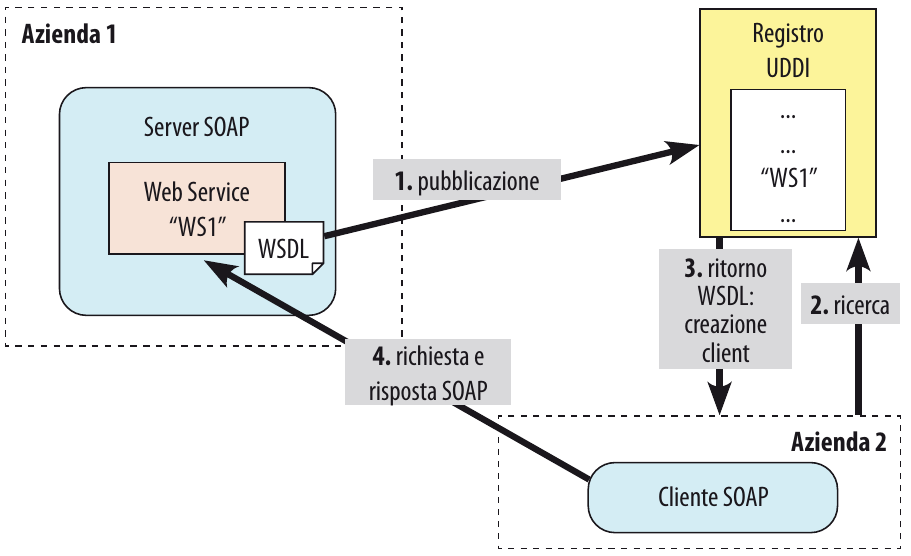
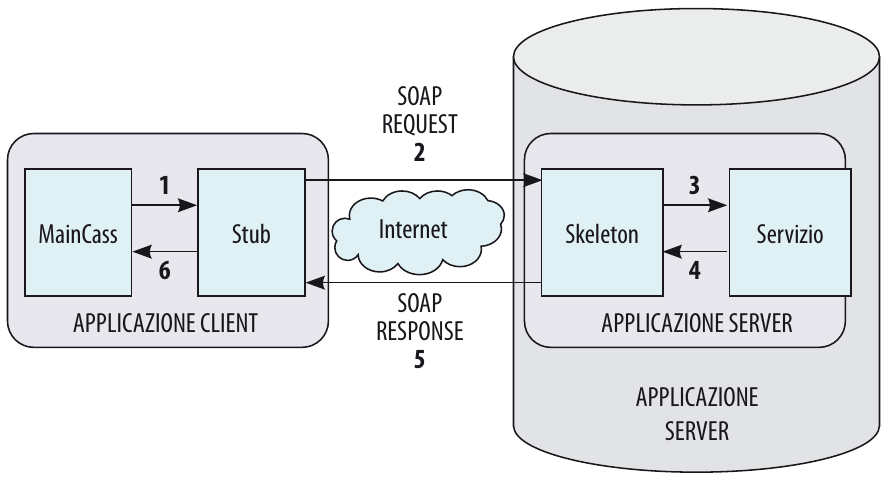

<style>
:root {
  font-family: 'SF Pro Text', serif !important;
}

code {
   font-family:  "Fantasque Sans Mono", monospace !important;
}

h1 {
  font-size: 2.5em !important;
  color: #1E1E1E !important;
}

section{
  justify-content: flex-start;
}

img[alt~="right"] {
  display: block;
  margin: 0 0;
  float: right;
}

img[alt~="center"] {
  display: block;
  margin: 0 auto;
}
</style>

# SOAP e REST

---

## Introduzione
Il Web rappresenta un’enorme piattaforma per la condivisione di documenti in formato ipertestuale interconnessi mediante parole chiave, indipendentemente dalla piattaforma hardware o software utilizzata. Inoltre il web si è evoluto grazie alla standardizzazione di alcuni semplici concetti, come:
- URI: il meccanismo per individuare risorse in una rete
- Http: il protocollo semplice e leggero per richiedere una risorsa a una macchina
- HTML: il linguaggio per la rappresentazione dei contenuti

Il Web è diventato “una piattaforma applicativa distribuita” dove ai documenti testuali si sono aggiunti contenuti multimediali, alle staticità delle pagine HTML dei primi anni si è passati a un’interazione tra più componenti software e a una dinamicità anche dovuta alla presenza di applicazioni software interoperabili: vennero introdotte lato server inizialmente le CGI e successivamente JSP, PHP, ASP ecc.

---

## Introduzione

L'evoluzione ha portato con sé una serie di problemi, tra cui il più importante è l'integrazione:

1. Tra le applicazioni informatiche sviluppate in modo indipendente in diverse parti del mondo.
2. Tra le applicazioni esistenti all'interno di un'azienda, a causa delle diverse tecnologie presenti all'interno dell'organizzazione.

Inoltre, il grande successo del Web negli anni passati ha spinto la rete a svolgere un ruolo più completo, per soddisfare le nuove esigenze legate alle interazioni tra applicazioni in contesti diversi.

---

## Introduzione

Negli anni Novanta nascono architetture complesse, vincolate dalla limitatezza del protocollo di comunicazione e dalle tecnologie coinvolte, che cercano comunque di fornire specifiche per rappresentare gli oggetti che vengono inviati e ricevuti. Tra le più famose ricordiamo CORBA (Common Object Request Broker Architecture),  Java RMI (Remote Method Invocation) e DCOM (Distributed Component Object Model).

Per superare i limiti del protocollo e garantire l'interoperabilità tra sistemi e piattaforme diverse, si sono sviluppate soluzioni RPC (Remote Procedure Call) che utilizzano XML. Questi meccanismi consentono a client e server di essere implementati con linguaggi e tecnologie diverse.

---

## Web service

Il passo successivo è stato quello di cercare di rendere standard le tecnologie coinvolte: nascono i primi Web Service
Un Web Service rappresenta la disponibilità di un servizio attraverso il Web, per esempio un servizio di ricerca di un volo, le disponibilità di un posto vengono restituite grazie ad un collegamento in tempo reale con il sistema di prenotazione della compagnia aerea, attraverso un **API** (Application Programming Interface) che espone le funzionalità del sistema.

---

## Web service
Per poter far comunicare tra loro applicazioni sviluppate in linguaggi diversi, è necessario che esse utilizzino un linguaggio comune per lo scambio di informazioni, come XML o JSON. Inoltre, è necessario che le applicazioni siano in grado di comunicare con un protocollo comune, come HTTP.

> "Un WS è un’applicazione software identificata da un URI, le cui interfacce pubbliche e relativi binding sono definiti e descritti in XML. La sua definizione può essere trovata da altre applicazioni software. Questi ultimi possono poi interagire con il WS seguendo le direttive presenti nella definizione del servizio, usando messaggi XML trasportati da protocolli Internet.""
> 
> [Web Services Architecture](https://www.w3.org/TR/ws-arch/)

---

## Web service

Un Web Service non trasmette testo e grafica, ma soddisfa richieste, che interagiscono direttamente tra due computer spesso senza alcun intervento umano: i computer possono utilizzare i servizi Web per comunicare direttamente tra loro a basso livello, inviare e ricevere dati, condividere funzioni e metodi.

> Un servizio è quindi una risorsa che offre un set di funzionalità astratte mediante un’interfaccia che ne nasconde i dettagli implementativi garantendo indipendenza dalla sua implementazione.

Un Web Service è un framework utilizzato per consentire la comunicazione tra due computer tramite il Web, utilizzando una delle due soluzioni seguenti:

- Web Service SOAP (medium Http (POST) e formato XML)
- Web Service REST (medium Http (POST, GET, PUT, DELETE) e formato XML, JSON, Text)

---

## Web service

Quando uno sviluppatore crea un Web Service, si deve preoccupare di definire:
1. la logica di funzionamento del servizio, ovvero quello che dovrà fare: questo può spaziare da una semplice classe a un’applicazione molto complessa
2. il Web Container (Server) su cui verrà installato (per esempio Apache, Tomcat, JBoss, GlassFish) e che ne consentirà l’uso da parte dei client.

---

## L'architettura SOA

L'architettura SOA (Service Oriented Architecture) è un modello architetturale che permette di realizzare applicazioni software distribuite, basate su servizi, che interagiscono tra loro.

L’architettura SOA deve fornire una piattaforma per costruire servizi applicativi aventi le seguenti caratteristiche:

- loosely coupled: l’utente di un servizio non deve preoccuparsi di scegliere con quali servizi comunicare, “ci pensa” l’infrastruttura
- location transparent: l’infrastruttura deve nascondere quanti più dettagli tecnici possibili, relativi a tecnologie tra loro differenti, al richiedente del servizio
- protocol independent: deve essere possibile aggiornare in qualunque momento le implementazioni, senza modificare le interfacce

---

## L'architettura SOA

Gli attori principali di un’architettura SOA sono 3:

- **Service Provider**: è il fornitore del servizio, che lo rende disponibile agli utenti
- **Service Registry**: contiene il repository dei servizi disponibili, con le relative interfacce. Fornisce al Service Consumer l'interface contract del Service Provider. Praticamente è un catalogo dei servizi disponibili
- **Service Consumer**: è l'utente del servizio, che ne fa richiesta al Service Registry

---

## L'architettura SOA
In sintesi la dinamica avviene in tre fasi:
1. Richiesta del servizio da parte del Service Consumer
2. Richiesta della descrizione del servizio
3. Il Service Consumer utilizza l'interface contract per invocare il servizio

Naturalmente affinché un servizio sia disponibile deve essere pubblicata (`publish`) nel Service Registry dal Service Provider una copia della descrizione del servizio (service description)
Il servizio può essere cercato con `find` e poi invocato con `bind` e `invoke`.

---

## L'architettura SOA
Ad oggi ci sono due modi per implementare un'architettura SOA:
- SOAP (Simple Object Access Protocol)
- REST (REpresentational State Transfer)


---

## SOAP

SOAP è un protocollo standard per lo scambio di messaggi tra due o più sistemi. È un protocollo basato su XML, che permette di inviare messaggi tra due sistemi, indipendentemente dalla piattaforma e dal linguaggio di programmazione utilizzato.

Il ciclo di vita di un Web Service SOAP si può riassumere nelle seguenti fasi:

- il server (provider) crea il servizio la cui descrizione è affidata a un documento WSDL (Web Service Description Language) e lo pubblica in un apposito registro conforme allo standard Universal Description Discovery and Integration (UDDI)
- il client (consumer) interroga il registro per trovare il servizio di cui ha bisogno
- se la ricerca ha esito positivo, il client chiede al registro il documento WSDL per individuare gli indirizzi (URI) e i modi con cui interrogarlo

---

- il client, a partire dal WSDL, crea uno strato software (request agent) che interagisce con lo strato software del server (provider agent). Questi componenti, chiamati stub e skeleton (rispettivamente lato client e lato server), si occupano della gestione dei messaggi SOAP, assemblando e disassemblando messaggi nel formato XML per permettere la comunicazione automatica tra due sistemi informatici.

---



---

Nella figura seguente seguiamo in dettaglio l’ultima fase, cioè la comunicazione tra client e server dopo che il client ha analizzato il WSDL:

1. L’interfaccia lato client chiama un metodo del Web Service attraverso lo stub, che si occupa di trasformare la richiesta del client in un messaggio XML conforme al protocollo SOAP.
2. Il messaggio viene spedito al server tramite protocollo SOAP (REQUEST).
3. Lo skeleton riceve il messaggio SOAP, lo trasforma in chiamate al codice del linguaggio in cui è scritto il servizio lato server (per esempio in Java).
4. Il servizio lato server riceve la chiamata, elabora i dati e, tramite lo skeleton, assembla un messaggio SOAP pronto per essere spedito al client.
5. La risposta (RESPONSE) viene inviata al client e ricevuta dallo stub.
6. Lo stub estrae la risposta dal messaggio SOAP e la restituisce all’interfaccia che ha chiamato il servizio.

---



---

>Un messaggio SOAP è formato da una busta (envelope), che contiene un’intestazione e un corpo.
>Il corpo (body) racchiude le informazioni che il messaggio vuole effettivamente trasmettere, come per esempio un documento, oppure il nome di un metodo invocato e i relativi parametri. L’intestazione (header) contiene metadati e altre informazioni “non funzionali”, come per esempio le credenziali di autenticazione oppure l’ID della transazione.

---


Possiamo riassumere in uno schema la pila protocollare per i Web Service SOAP indicando tecnologie/linguaggi che ogni livello utilizza:

- **UDDI** (Universal Description, Discovery and Integration): è un registro contenente informazioni utili per la scoperta e l’accesso ai Web Service;
- **WSDL** (Web Services Description Language): descrive l’interfaccia esterna di un Web Service affinché uno sviluppatore possa creare un client capace di invocarlo;
- **SOAP** (Simple Object Access Protocol): descrive un protocollo basato su XML che definisce i meccanismi con cui un WS è invocato e il formato dell’input e dell’output (richiesta e risposta); è quindi un protocollo per lo scambio di messaggi;
- **XML** (eXtensible Markup Language): è un formato per lo scambio dei dati nello strato di trasporto ed è usato per descrivere la struttura dei messaggi scambiati tra servizi Web.

---

## REST

REST (REpresentational State Transfer) è un protocollo alternativo a SOAP per la realizzazione di Web Service. È un’architettura software che si basa sul protocollo HTTP e sul concetto di risorsa.

Rispetto a SOAP, REST utilizza i metodi HTTP (`GET`, `POST`, `PUT`, `DELETE`) per invocare le operazioni sui servizi, e i dati vengono trasmessi in formato XML, JSON o testo.

REST assume che le interazioni tra client e server debbano avvenire senza memorizzazione di informazioni di stato sul server, cioè le interazioni tra client e server devono essere senza stato (stateless).

REST è un modo più semplice per organizzare le interazioni tra sistemi indipendenti e ha iniziato a diffondersi nel Web dal 2005, soprattutto grazie al successo di applicazioni Web come Flickr, Google Maps e Twitter.

---

>REST definisce un insieme di principi architetturali per la progettazione di un sistema: non si riferisce a un sistema concreto e ben definito né si tratta di uno standard stabilito da un organismo di standardizzazione.

Secondo l’approccio REST i principi che rendono il Web adatto a realizzare Web Service si possono riassumere nei seguenti cinque:
1. Identificazione delle risorse con URI in forma di directory (Content Provider);
2. Utilizzo esplicito dei metodi HTTP;
3. Risorse autodescrittive;
4. Collegamenti tra risorse con interazioni stateless;
5. Comunicazione senza stato in XML, JavaScript Object Notation (JSON) o entrambi.

---

Il formato solitamente utilizzato per mandare e ricevere informazioni con un sistema REST è il JSON. Inoltre nell’header della richiesta si possono aggiungere oggetti come token di autenticazione ed eventuali dati che devono essere inviati in richieste PUT o POST possono essere aggiunti come parametri della richiesta o nel body della stessa.
Una sessione attiva verrà eliminata dopo un certo lasso di tempo, forzando l’utente a ricreare la sessione di tanto in tanto: tale autenticazione non va effettuata a ogni richiesta dato che l’utente può fornire l’id di sessione nell’header e, quindi, mantenerla aperta.

---

Le principali differenze tra SOAP e REST sono:

| SOAP | REST |
|------|------|
| Utilizza il protocollo HTTP e il formato XML | Utilizza il protocollo HTTP e il formato XML, JSON o testo |
| Incentrato sul servizio | Incentrato sulla risorsa |
| Metodi accessibili in remoto dal client | Tipiche chiamate HTTP |
| | Configurazione più semplice |

---

## Crud con REST

REST è un’architettura software che si basa sul protocollo HTTP e sul concetto di risorsa. Le operazioni CRUD (Create, Read, Update, Delete) sono mappate sui metodi HTTP:

| CRUD | HTTP | Descrizione |
|------|------|-------------|
| Create | POST | Crea una nuova risorsa |
| Read | GET | Legge una risorsa |
| Update | PUT | Aggiorna una risorsa |
| Delete | DELETE | Cancella una risorsa |

Questo principio è in contrasto col tipico uso di HTTP, dove spesso si utilizza il metodo `GET` per ottenere informazioni e `POST` per inviare dati.

```r
http://www.miaApplicazione.com/aggiungiCliente?cognome=Verdi
```

---

L'esempio precedente **non** è RESTful, perché utilizza il metodo `GET` per creare una nuova risorsa. Un approccio RESTful sarebbe:

```json
POST http://www.miaApplicazione.com/clienti
{
  "cognome": "Verdi"
}
```

---

## Conclusione

SOAP e REST sono due approcci diversi per realizzare Web Service. Entrambi hanno vantaggi e svantaggi, e la scelta tra i due dipende dalle esigenze del progetto, ma REST è meglio. Ora per dimostrare che REST sia meglio una lista di punti a favore:

1. **Utilizzo delle tecnologie standard**: SOAP richiede l’utilizzo di tecnologie specifiche, come WSDL, mentre REST utilizza tecnologie standard come HTTP e XML/JSON.
2. **Separazione tra client e server**: REST permette di separare completamente l'interfaccia dal server.
3. **Portabilità dell’interfaccia ad altri tipi di piattaforme**: REST è più portabile rispetto a SOAP. Ad esempio, un servizio REST può essere utilizzato da un’applicazione Web, da un’applicazione mobile o da un’applicazione desktop.

---

4. **Vantaggi dell'architettura client-server**: facilità di scalabilità orizzontale e separazione tra componenti.
5. **Indipendenza dall'ambiente tecnologico**: API REST adatta a diversi linguaggi e piattaforme, con preferenza per lo scambio in JSON.
6. **Consenso industriale**: Microsoft ha proposto e condiviso specifiche XML, permettendo interventi di altri attori del settore.
7. **Disponibilità di strumenti per la creazione di Web Service**: gratuiti o a pagamento, adatti a diverse piattaforme e linguaggi di programmazione.

---

Esistono moltissimi servizi Web RESTful che utilizziamo regolarmente senza saperlo: alcun sono disponibili gratuitamente mentre altri sono a pagamento; di seguito ne elenchiamo alcuni tra i più famosi:
- Google: fornisce quasi la totalità dei propri servizi come API RESTful, per esempio per Gmail come per Translate
- SoundCloud: la API RESTful del famoso sito per caricare e ascoltare musica permette di disporre di un player per lo streaming integrabile su qualsiasi piattaforma, che generalmente viene interrogato direttamente in JavaScript

---

## Elenco casuale di servizi REST

[https://www.google.com/maps/dir/milano/padova](https://www.google.com/maps/dir/milano/padova)

[https://animechan.xyz/api/random/anime?title=cowboy bebop](https://animechan.xyz/api/random/anime?title=cowboy%20bebop)

[https://api.artic.edu/api/v1/artworks/27992?fields=id,title,image_id](https://api.artic.edu/api/v1/artworks/27992?fields=id,title,image_id)
[https://www.artic.edu/iiif/2/2d484387-2509-5e8e-2c43-22f9981972eb/full/843,/0/default.jpg](https://www.artic.edu/iiif/2/2d484387-2509-5e8e-2c43-22f9981972eb/full/843,/0/default.jpg)

[https://bible-api.com/1%20timothy%202:12](https://bible-api.com/1%20timothy%202:12)

[https://api.github.com/users/steccah](https://api.github.com/users/steccah)

[https://economia.awesomeapi.com.br/json/last/TRY-EUR](https://economia.awesomeapi.com.br/json/last/TRY-EUR)
