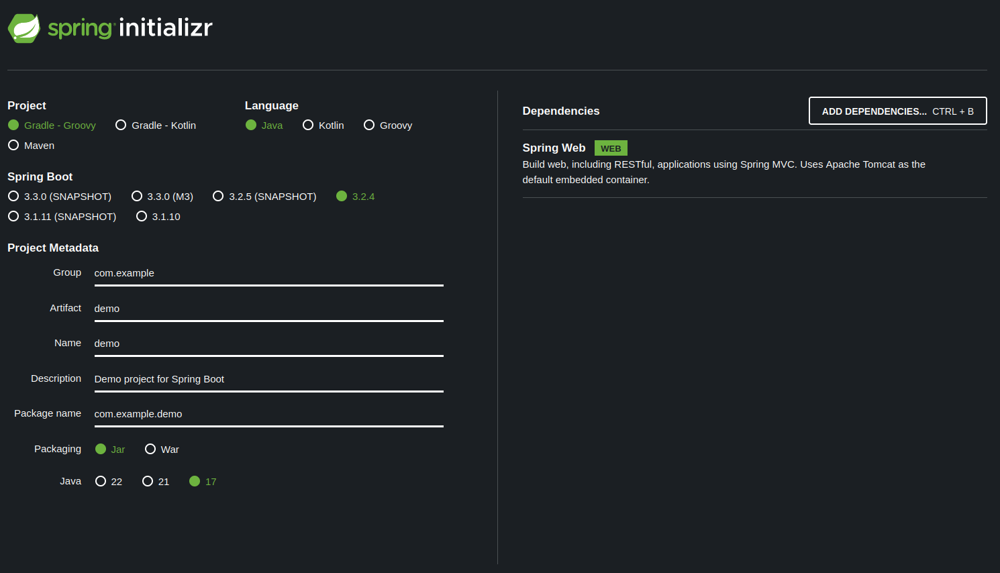

<style>
:root {
  font-family: 'SF Pro Text', serif !important;
}

code {
   font-family:  "Fantasque Sans Mono", monospace !important;
}

h1 {
  font-size: 2.5em !important;
  color: #1E1E1E !important;
}

section{
  justify-content: flex-start;
}

img[alt~="right"] {
  display: block;
  margin: 0 0;
  float: right;
}

img[alt~="center"] {
  display: block;
  margin: 0 auto;
}
</style>

# REST API con Java Spring

---

## Java Spring

Per creare un REST API con Java Spring, è necessario utilizzare **spring initializr** [start.spring.io](https://start.spring.io/).



---

Si può scegliere il linguaggio, la versione di Spring Boot, le dipendenze e il progetto.
Nel nostro caso possiamo lasciare tutto default e aggiugnere solo la dipendenza **Spring Web**.

Avremo così un progetto con una struttura base.

---

## Struttura del progetto

```
.
└── src
    └── main
        └── java
            └── com
                └── example
                    └── demo
                        ├── DemoApplication.java
                        ├── Greeting.java
                        └── HelloController.java
```


---

## Prima API

Per creare una API, è necessario creare una classe con un metodo che restituisca un oggetto.

```java
@RestController
public class HelloController {

    @GetMapping("/hello")
    public String hello() {
        return "Hello World!";
    }
}
```
In questo caso, la classe `HelloController` è un **RestController** e il metodo `hello` restituisce una stringa sulla "route" `/hello`.

---

## Parametri

Per passare parametri, è possibile utilizzare l'annotazione `@RequestParam`.

```java
@GetMapping("/hello")
public String hello(@RequestParam(value = "name", defaultValue = "World") String name) {
    return "Hello " + name + "!";
}
```
In questo caso, il parametro `name` è opzionale e ha un valore di default `World`.

---

## Record

In java è possibile utilizzare i **record** per creare classi con pochi campi.

```java
public record Greeting(long id, String content) {}
```

In questo caso, il record `Greeting` ha due campi: `id` e `content`.

```java
private int counter = 0;

@GetMapping("/hello")
public Greeting hello(@RequestParam(value = "name", defaultValue = "World") String name) {
    return new Greeting(counter++, "Hello " + name + "!");
}
```

Il record può essere restituito come risposta, e verrà automaticamente convertito in JSON.


