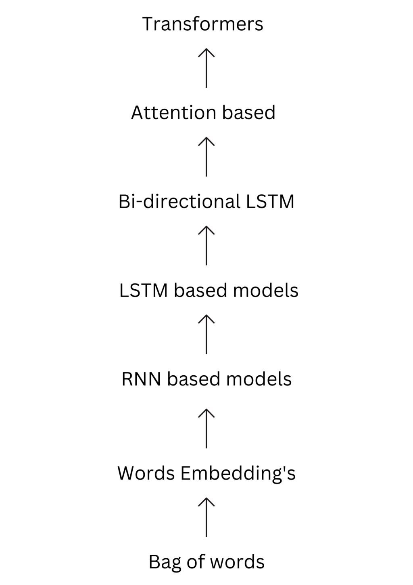

# LLM

---

## Cosa sono i LLM

I LLM (Large Language Models) sono modelli di linguaggio che utilizzano l'apprendimento automatico per generare testi. Sono in grado di scrivere articoli, scrivere codice, rispondere a domande, ecc.

Gli LLM acquisiscono questa capacità adoperando enormi quantità di dati per apprendere miliardi di parametri nell'addestramento e consumando grandi risorse di calcolo nell'operatività. L'aggettivo "grande" presente nel nome si riferisce alla grande quantità di parametri del modello probabilistico (nell'ordine dei miliardi).

Gli LLM attuali sono in larga parte reti neurali artificiali e in particolare trasformatori

---

## I trasformatori

Un trasformatore è un'architettura di rete neurale sviluppata da [Google nel 2017](https://en.wikipedia.org/wiki/Attention_Is_All_You_Need). Il testo viene convertito in numeri reali chiamati token, e ogni token viene convertito in un vettore attraverso una funzione di embedding. Questi vettori vengono poi elaborati da più livelli di trasformazione.

---

---

## I parametri

I parametri di un modello di apprendimento automatico sono i pesi delle connessioni tra i neuroni. Maggiore è il numero di parametri, maggiore è la capacità del modello di adattarsi ai dati di addestramento. Generalmente, un modello con più parametri è in grado di apprendere più dettagli dai dati, ma è anche più incline all'overfitting.

GPT-3 ha 175 miliardi di parametri
LLAMA ha 300 miliardi di parametri

---

## Compressione

I modelli di grandi dimensioni sono difficili da addestrare e utilizzare a causa delle loro dimensioni. Per questo motivo, è importante sviluppare tecniche di compressione che riducano le dimensioni del modello senza comprometterne le prestazioni.

La tecnica di compressione più comune è la quantizzazione, che consiste nel ridurre la precisione dei parametri del modello. Ad esempio, si possono rappresentare i pesi come numeri interi a 8 bit anziché numeri in virgola mobile a 32 bit. Questo riduce significativamente la dimensione del modello senza influire in modo significativo sulle prestazioni.

---

## I token

I token sono le unità di base di un modello di linguaggio. Ogni parola o simbolo nel testo viene convertito in un token numerico che rappresenta il suo significato. I token vengono quindi elaborati dalla rete neurale per generare il testo di output.

I token possono essere di diversi tipi, a seconda del modello di linguaggio utilizzato. Ad esempio, un token può rappresentare una parola, un carattere o un simbolo speciale come un punto o una virgola.

A seconda del modello ci sono vari tipi di token, ad esempio BPE, Byte Pair Encoding, WordPiece, ecc.

ChatGPT utilizza token di tipo BPE

> "ChatGPT è incredibile!" diventa `["Chat", "GPT", "è", "incredibile", "!"]`

---

## Fine-tuning

Il fine-tuning è una tecnica di addestramento che consiste nel modificare i pesi di un modello preaddestrato per adattarlo a un compito specifico. Questo permette di ottenere prestazioni migliori su un compito specifico senza dover addestrare un modello da zero.

Un esempio di fine-tuning è l'addestramento di un modello di linguaggio preaddestrato per la generazione di codice. Il modello viene addestrato su un dataset di esempi di codice sorgente e poi utilizzato per generare codice, come ad esempio llama2 e codellama

---

## Modelli open-source

Esistono diversi modelli di linguaggio open-source che possono essere utilizzati per vari compiti. Alcuni esempi includono:

- Gemma: un modello di linguaggio open-source a 2b e 7b di parametri sviluppato da DeepMind

- llama2: un modello di linguaggio open-source a 7b, 13b e 70b di parametri sviluppato da Meta

- llama3: un modello di linguaggio open-source a 8b e 70b di parametri sviluppato da Meta

- mistral: un modello di linguaggio open-source a 7b di parametri sviluppato da Mistral AI

---

- qwen: un modello di linguaggio open-source a 0.5b, 1.8b, 4b, 32b, 72b e 110b di parametri sviluppato da Alibaba Cloud

- phi3: un modello di linguaggio open-source a 3b e 14b di parametri sviluppato da Microsoft

- deepseek-coder: un modello di linguaggio open-source a 1b, 7b e 33b di parametri sviluppato da DeepSeek AI

- codellama: un modello di linguaggio open-source a 7b, 13b, 34b e 70b di parametri sviluppato da Meta e basato su llama2

---

## Costo di addestramento

Il costo di addestramento di un modello di linguaggio è determinato principalmente dalla quantità di dati utilizzati per l'addestramento e dalla potenza di calcolo necessaria per addestrare il modello. I modelli di grandi dimensioni come GPT-3 e llama2 richiedono enormi quantità di dati e risorse di calcolo per essere addestrati, e di conseguenza hanno un costo elevato.

I costi sono principalmente legati all'energia elettrica necessaria per alimentare i server e per comprare le GPU necessarie per l'addestramento. GPT-4 è costato più di 100 milioni di dollari per essere addestrato, llama3 ha richiesto un investimento di 720 milioni di dollari solo per comprare le gpu, senza contare il costo dell'energia elettrica.

---

## Requisiti hardware

Per poter eseguire un modello di linguaggio di grandi dimensioni come llama2 o llama3 è necessario disporre di una grande quantità di memoria RAM o VRAM, oltre a una GPU di fascia alta. I modelli di grandi dimensioni richiedono molta memoria per memorizzare i parametri del modello e i dati di input, e una GPU di fascia alta per eseguire i calcoli necessari per l'elaborazione dei dati.

Si può stimare la RAM/VRAM necessaria:
- per FP32: 5GB per 1b di parametri
- per FP16: 2.5GB per 1b di parametri
- per INT8: 1.25GB per 1b di parametri

Quindi gpt-3 essendo a 175b e FP16 richiede 437.5GB di VRAM
In realtà 1.75\*10¹¹ parametri \* 2 (i byte di un FP16) ci da 3.5\*10¹¹ byte, che sono 350GB

---

## Bias

I modelli di linguaggio possono essere influenzati dai dati di addestramento e quindi essere soggetti a bias. Il bias nei modelli di linguaggio può manifestarsi in vari modi, ad esempio attraverso stereotipi di genere, razziali o culturali presenti nei dati di addestramento.

Per ridurre il bias nei modelli di linguaggio è importante utilizzare dati di addestramento diversificati e bilanciati, e adottare tecniche di regolarizzazione e controllo per garantire che il modello non apprenda bias dai dati.
